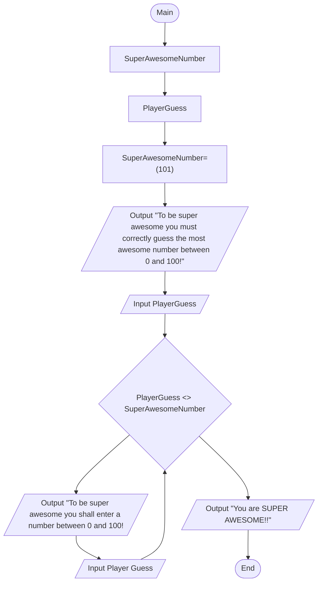

## Super Awesome Number Guessing Game

```mermaid
flowchart TD
  A([Main]) --> B@{ shape:win-pan, label: "SuperAwesomeNumber" }
  B --> C@{ shape:win-pan, label: "PlayerGuess" }
  C --> D@{ shape: rect, label: SuperAwesomeNumber=(101) }
  D --> E[/Output "To be super awesome you must correctly guess the most awesome number between 0 and 100!"/]
  E --> F[/Input PlayerGuess/]
  F --> G{PlayerGuess <> SuperAwesomeNumber}
  G --> H[/Output "To be super awesome you shall enter a number between 0 and 100!/] & J[/Output "You are SUPER AWESOME!!"/]
  H --> I[/Input Player Guess/]
  I --> G
  J --> K([End])
```
